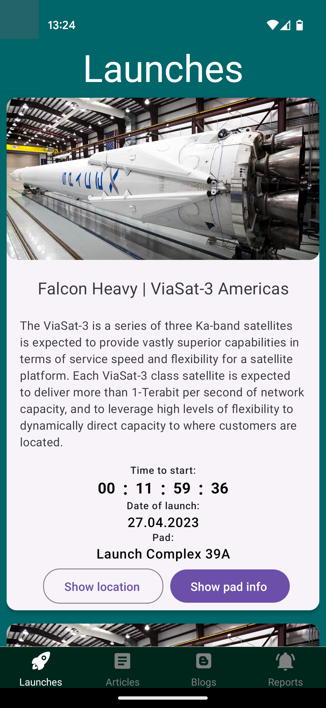
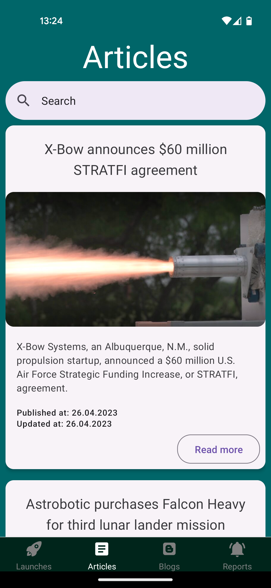
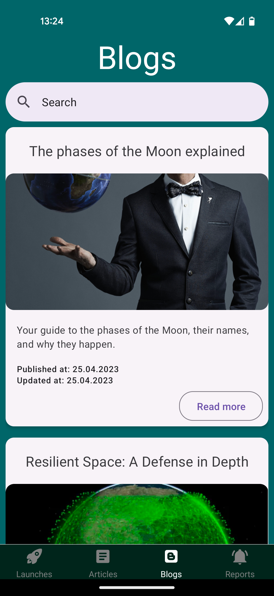
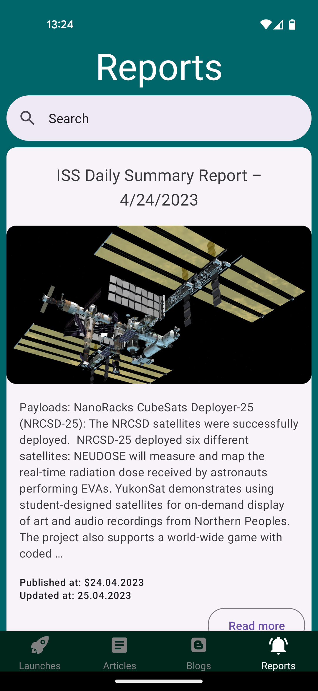

# Space Flight News

Mobile application for viewing upcoming rocket launches and browsing new articles, blogs or reports about space flight.

## Build with

- React Native
- Expo
- TypeScript

# Views

1. Launches
2. Blogs
3. Reports
4. Articles

# Data Source

APIs:

- [Spaceflight News API](https://thespacedevs.com/llapi)
- [Launch Library](https://ll.thespacedevs.com/2.2.0/swagger/)
